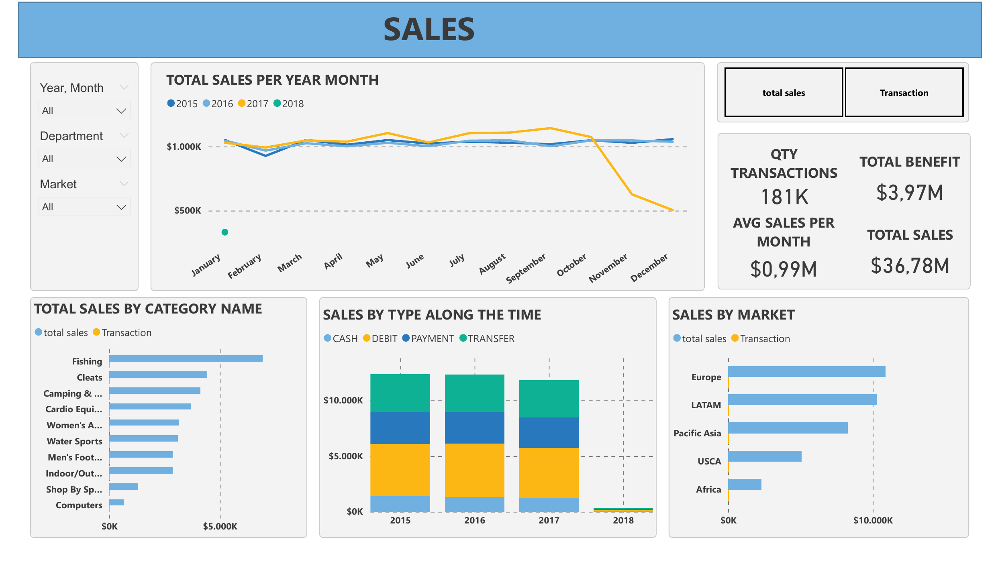

# Data Analytics Portfolio — Luciano Mingolla

Data Analyst with 2+ years of experience | SQL · Power BI · DAX · SAP ERP · Python  
Focus: operational analytics, KPI development and business intelligence  
Background in supply chain, logistics and operations

---

## Projects

### [Project 001 — Operations KPI Dashboard](./project-001-powerbi-operations/project-001-powerbi-operations-dashboard)
**Stack:** Power BI · DAX · Power Query  
**Industry:** Office Supplies & Technology Distribution  
Interactive dashboard tracking sales vs target and shipping KPIs for a US-based distributor operating across 4 regions and 3 customer segments.

---

### [Project 002 — Sales & Commercial Performance Dashboard](./project-002-sql-to-powerbi-analysis)
**Stack:** Power BI · DAX · Power Query  
**Industry:** Sports Retail — Global Markets  
Commercial performance and discount analysis dashboard for a global sports retailer operating across 5 markets, evaluating revenue trends and the impact of discount strategy on net sales.

---

## Contact

📧 luciano.mingo@gmail.com  
🔗 [linkedin.com/in/luciano-mingolla](https://linkedin.com/in/luciano-mingolla)  
📍 Barcelona, Spain — Open to remote roles
