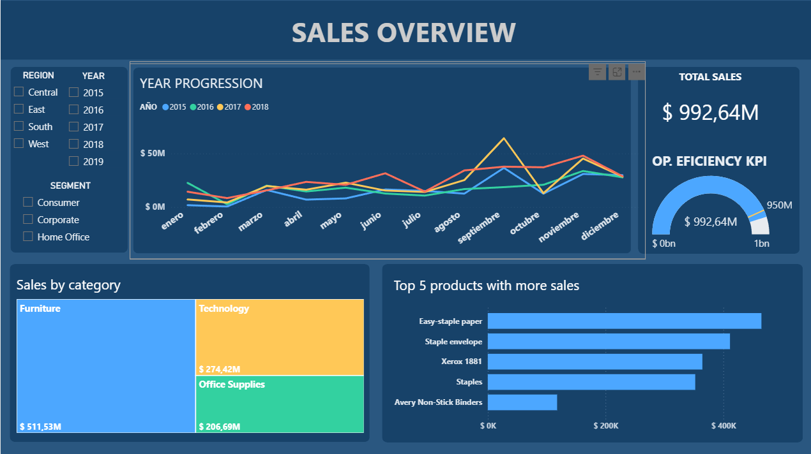
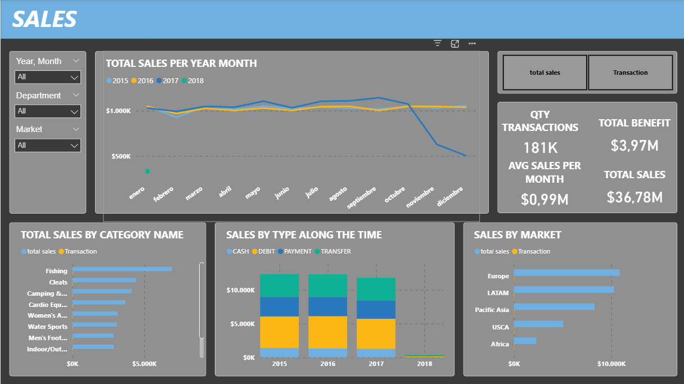

# Data Analytics Portfolio — Luciano Mingolla

Data Analyst with 2+ years of experience | SQL · Power BI · DAX · SAP ERP · Python  
Focus: operational analytics, KPI development and business intelligence  
Background in supply chain, logistics and operations

---

## Projects

### [Project 001 — Operations KPI Dashboard](./project-001-powerbi-operations/project-001-powerbi-operations-dashboard)
**Stack:** Power BI · DAX · Power Query  
End-to-end Power BI project tracking sales performance and shipping KPIs across regions, segments and years. Includes data modelling, DAX measures and interactive filtering.

---

### [Project 002 — SQL to Power BI: End-to-End Sales Analysis](./project-002-sql-to-powerbi-analysis)
**Stack:** SQL · Power BI · DAX  
Full analytics pipeline: data extraction with SQL, transformation in Power Query, star-schema modelling, and interactive dashboards tracking sales, transactions and discount performance.

---

## Contact

📧 luciano.mingo@gmail.com  
🔗 [linkedin.com/in/luciano-mingolla](https://linkedin.com/in/luciano-mingolla)  
📍 Barcelona, Spain — Open to remote roles
