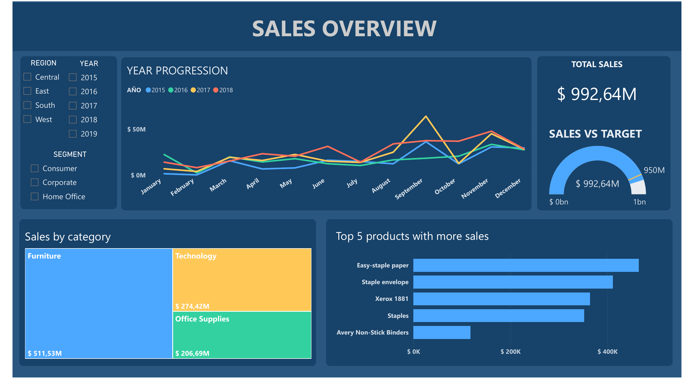
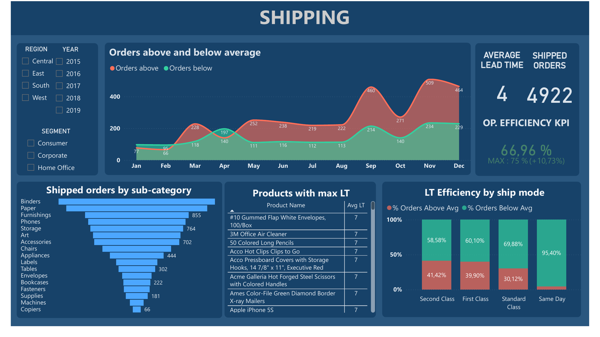

# Project 001 — Operations KPI Dashboard

**Stack:** Power BI · DAX · Power Query  
**Domain:** Sales & Operational Performance  
**Industry:** Office Supplies & Technology Distribution

---

## Business Context

A US-based distributor of office supplies and technology products — operating across four regional markets (Central, East, South and West) and serving Consumer, Corporate and Home Office segments — was relying on static Excel reports to track commercial and operational performance.

The operations and commercial teams had no unified view of sales trends, target achievement or shipping efficiency. Decisions were made reactively, without the ability to filter by region, segment or time period in real time.

**The goal:** replace manual reporting with an interactive Power BI dashboard that consolidates sales and shipping KPIs into a single decision-support tool.

**Key business questions answered:**
- Are we hitting our sales target? Which regions or segments are underperforming?
- - How is sales performance trending month by month and year over year?
  - - Which product categories and products drive the most revenue?
    - - What is our average lead time, and which shipping modes are most efficient?
      - - How many orders are being shipped above vs below the performance average?
       
        - ---

        ## Dashboard Overview

        ### Page 1 — Sales Overview
        Tracks total revenue vs target, monthly and yearly sales progression, category breakdown and top products by revenue.

        

        ### Page 2 — Shipping Performance
        Monitors average lead time, shipped order volume and operational efficiency KPI. Highlights orders above and below average by month, and breaks down lead time efficiency by shipping mode and sub-category.

        

        ---

        ## What Was Built

        - **Data model:** star schema with relationships between sales facts, products, regions, segments and a custom date table
        - - **DAX measures:** Total Sales, Sales vs Target, Operational Efficiency KPI, Average Lead Time, YoY comparisons, orders above/below average
          - - **Power Query:** data cleaning, column transformation, date table creation with English locale
            - - **Interactive filters:** region, year, customer segment — cross-filtering across all visuals
             
              - ---

              ## Key KPIs

              | KPI | Description |
              |---|---|
              | Total Sales | Revenue aggregated by period, region and category |
              | Sales vs Target | Actual sales tracked against a $950M target |
              | Operational Efficiency KPI | % of orders meeting the performance threshold |
              | Average Lead Time | Mean days from order to shipment |
              | Orders Above / Below Average | Volume split to identify bottleneck periods |
              | LT Efficiency by Ship Mode | % of on-time orders per shipping method |

              ---

              ## Files

              | File | Description |
              |---|---|
              | `dashboard.pbix` | Power BI source file |
              | `dashboard-sales-overview.png` | Sales Overview page screenshot |
              | `dashboard-shipping-performance.png` | Shipping Performance page screenshot |

              ---

              ## Stack

              
              
              
