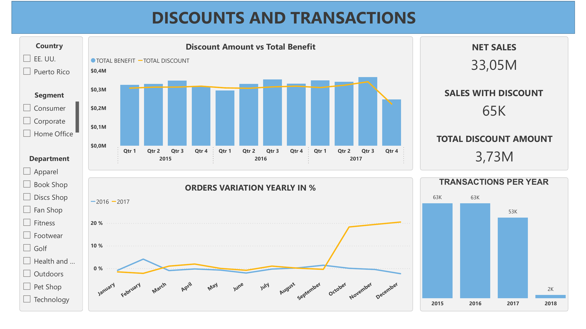

# Project 002 — Sales & Commercial Performance Dashboard

**Stack:** Power BI · DAX · Power Query  
**Domain:** Commercial Performance & Discount Analysis  
**Industry:** Sports Retail — Global Markets

---

## Business Context

A global sports retail company operating across five markets (Europe, LATAM, Pacific Asia, USCA and Africa) needed a clearer view of its commercial performance across product categories and regions.

The finance and commercial teams were working with fragmented data and had two key unresolved questions: which markets and categories were driving revenue, and whether the company’s discount strategy was generating incremental sales or simply eroding margin.

**The goal:** build an interactive Power BI dashboard that tracks sales performance and evaluates the real impact of discounts on net revenue.

**Key business questions answered:**
- Which markets and product categories generate the most revenue?
- - How is total sales volume trending month by month and year over year?
  - - What is the relationship between discount spend and total benefit?
    - - Are discounts driving more transactions or just reducing margin?
      - - How does order volume vary across years and payment types?
       
        - ---

        ## Dashboard Overview

        ### Page 1 — Sales Performance
        Tracks total sales, transaction volume, average sales per month and total benefit. Filterable by year, department and market. Includes breakdown by category, payment type and geographic market.

        

        ### Page 2 — Discounts & Transactions
        Analyses quarterly discount amount vs total benefit, net sales, order variation year over year and transaction volume per year. Filterable by country, segment and department.

        

        ---

        ## What Was Built

        - **Data model:** relationships between sales facts, products, markets, segments and a custom date table
        - - **DAX measures:** Total Sales, Net Sales, Total Benefit, Total Discount Amount, Transactions per Year, Orders Variation YoY %
          - - **Power Query:** data cleaning, null handling, country name standardisation, date table with English locale
            - - **Interactive filters:** country, segment, department, year — cross-filtering across all visuals
             
              - ---

              ## Key KPIs

              | KPI | Description |
              |---|---|
              | Total Sales | Gross revenue across all markets and categories |
              | Net Sales | Revenue after discounts applied |
              | Total Benefit | Net margin contribution |
              | Total Discount Amount | Absolute discount spend across all transactions |
              | Sales with Discount | Number of transactions where a discount was applied |
              | Orders Variation YoY % | Growth or decline in order volume by period |
              | Transactions per Year | Total order volume trend across years |

              ---

              ## Files

              | File | Description |
              |---|---|
              | `dashboard.pbix` | Power BI source file |
              | `dashboard-sales.png` | Sales Performance page screenshot |
              | `dashboard-discounts-transactions.png` | Discounts & Transactions page screenshot |

              ---

              ## Stack

              
              
              
